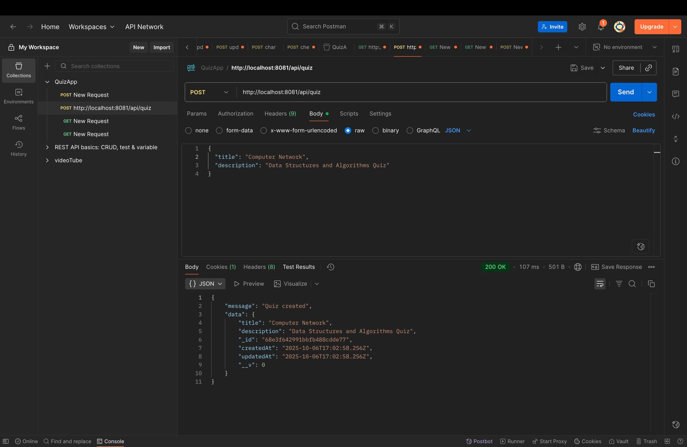
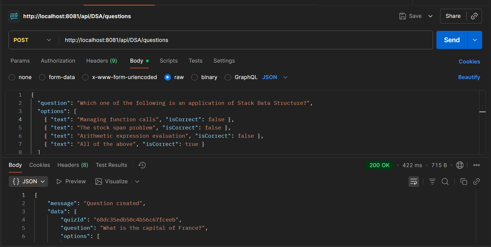
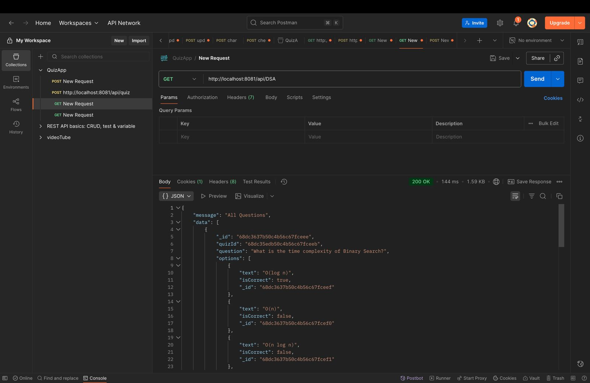
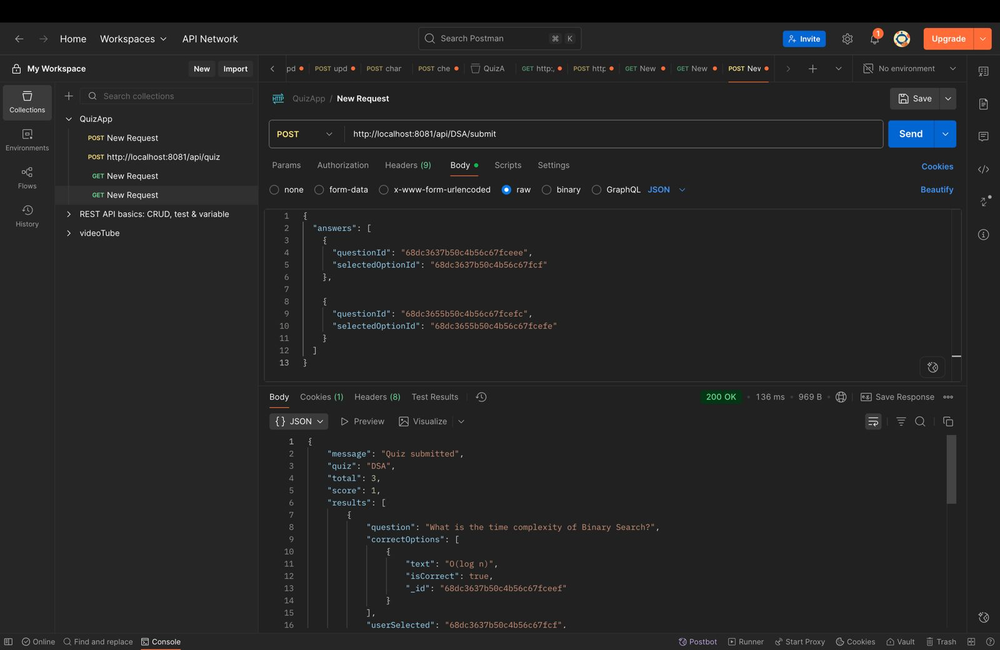

<!-- PROJECT LOGO -->
<div align="center">
    <!--  -->
    <!--  -->
  <h1 align="center"><b>Quiz Application: AI-Powered Companion for Smarter Financial Health and Family Wealth Management.</b></h1>

</div>

<!-- ABOUT THE PROJECT -->
<br>

<!-- ## ♾️ Problem Statement

Enhancing Customer Experience in Banking and Finance - Empowering Customers with AI-Driven Financial Insights.

## ♾️ Solution

Citiwise is a personalized financial advisory platform designed to help users make better financial decisions with features like a dual scoring system to monitor credit and financial health, AI-driven spending and saving goals, and personalized investment suggestions based on risk tolerance and income. It enables families to manage all accounts in one place, offering clear visualizations for better financial tracking. Additionally, Citiwise includes innovative tools like citiGPT, an AI financial assistant, a gamified self-paced learning path for financial literacy, and daily learning challenges to encourage user engagement and improve financial management skills. -->

## ⚙️ Built With

The technologies and tools used are:

- HTML
- CSS
- JavaScript
- NodeJS
- ExpressJS

<!-- GETTING STARTED -->

## 🧑‍💻 Getting Started

### Installation

1. Clone the repository

   ```sh
   git clone https://github.com/sanketdisale871/QuizApplication.git
   ```

2. Install the dependencies:

   ```sh
   npm i
   ```

3. Start Application:
   ```sh
   nodemon server.js
   ```

### :file_folder: File Structure

```
.
├── controller
│   ├── allQuestions.controller.js
|   ├── question.controller.js
│   ├── quiz.controller.js
│   ├── subQuiz.controller.js
│
├── db
|   ├── database.js
|
├── model
|   ├── question.models.js
|   ├── quiz.models.js
|
├── route
|   ├── route.js
|
├── server.ja
|
└── README.md
```

<!-- CONTRIBUTING -->

## Endpoints of Quiz App

### Quiz Creation : Creates a new quiz by providing a quiz title and other optional metadata.

```sh
POST /api/quiz
```

**Request Body and Response Example:**  
 

### Create Question : Adds one or more questions to an existing quiz.Creates a new quiz by providing a quiz title and other optional metadata.

```sh
  POST /api/:quiztitle/questions
```

**Request Body and Response Example:**  
 

### Get All Questions: Fetches all questions for a given quiz title (without showing correct answers).

```sh
  GET /api/:quiztitle
```

**Request Body and Response Example:**  
 

### Quiz Submit: Submits a user's answers for evaluation and returns the total score.

```sh
    POST /api/:quiztitle/submit
```

**Request Body and Response Example:**  
 
